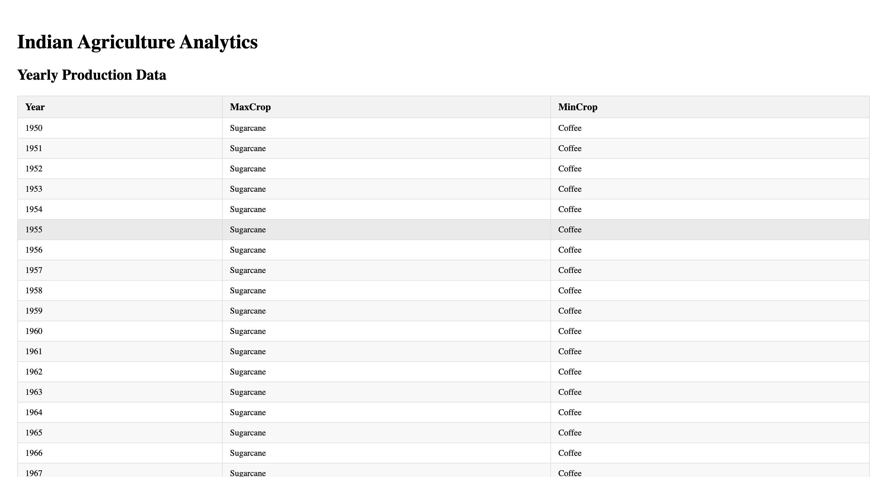
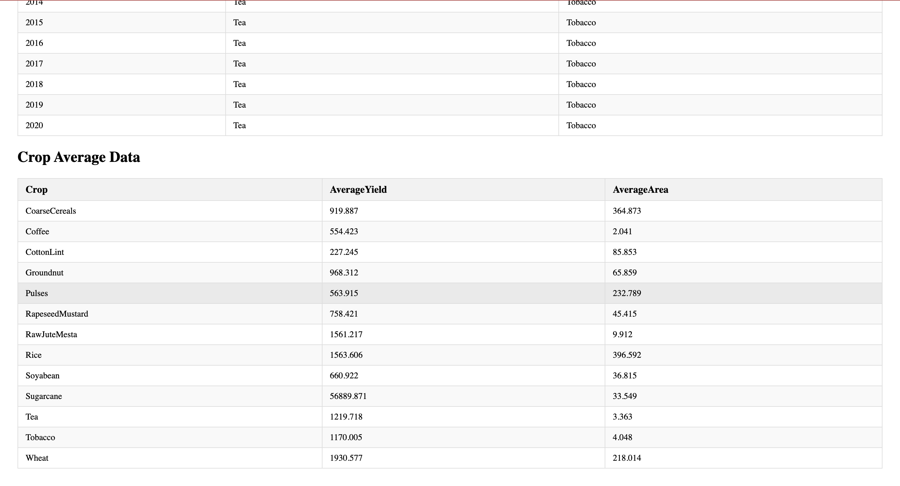

# Crop Production Data Analysis

This project processes and displays crop production data using React. The data includes various crop types, their production, yield, and area under cultivation, grouped by year. It uses TypeScript for type safety and ensures a user-friendly interface to display the information in tabular format.

## Features

- **Yearly Production Data**: Displays crop production data grouped by year, showing the crop with the maximum and minimum production.
- **Crop Average Data**: Calculates the average yield and average area under cultivation for each crop.
- **Data Representation**: Data is displayed in two separate tables with clear styling for better readability.

## Technologies Used

- **React**: For building the user interface.
- **TypeScript**: For type safety and better development experience.
- **CSS**: For styling the tables and making them user-friendly.
- **Data Manipulation**: Using JavaScript array methods like `reduce()` and `map()` to process data.

## Table Layout

### Yearly Production Data Table

This table shows the following columns:

- **Year**: The year for which the crop production data is available.
- **Max Crop**: The crop with the maximum production for that year.
- **Min Crop**: The crop with the minimum production for that year.

### Crop Average Data Table

This table shows the following columns:

- **Crop**: The type of crop.
- **Average Yield (Kg/Ha)**: The average yield of the crop per hectare.
- **Average Area (Ha)**: The average area under cultivation for that crop.

---

## Setup Instructions

To get the project up and running on your local machine, follow these steps:

### 1. Clone the repository

```bash
git clone https://github.com/ss-sahoo/crop-production-data-analysis.git
```

### 2. Install dependencies

Navigate to the project directory and install the necessary dependencies:

```bash
cd crop-production-data-analysis
yarn
```

### 3. Start the development server

Run the following command to start the development server:

```bash
yarn dev
```

The app will be available at `http://localhost:5173/`.

---

## Usage

1. **Input Data**: Data is loaded from a JSON file, which contains crop information such as production, yield, and area for each crop in different years.
2. **Display Data**: Once the data is loaded, two tables will be displayed on the screen:
   - The **Yearly Production Data Table** shows the year, crop with maximum production, and crop with minimum production.
   - The **Crop Average Data Table** shows the average yield and area for each crop.

---

## Screenshots

Below are the screenshots of both tables:

### Yearly Production Data Table



### Crop Average Data Table



---

## Code Structure

The code is organized into the following main files:

- **`App.tsx`**: The main entry point of the application. Handles loading data and passing it to components.
- **`TableDisplay.tsx`**: A reusable component that renders a table based on the passed data.
- **`types.ts`**: Contains TypeScript types for better type safety.
- **`utils`**: Contains functions for data processing (e.g., calculating yearly production data and crop averages).
